# Eye-diagram gallery (pure-ngspice D2D link)

Generated by `plot_eyes.py`. 16 GT/s, UI = 62.5 ps, 2 mm interposer channel, victim + 2 crosstalk aggressors. See `../../README.md` for the full circuit/netlist documentation.

## Circuit model (drawn by `draw_schematics.py`)

System view

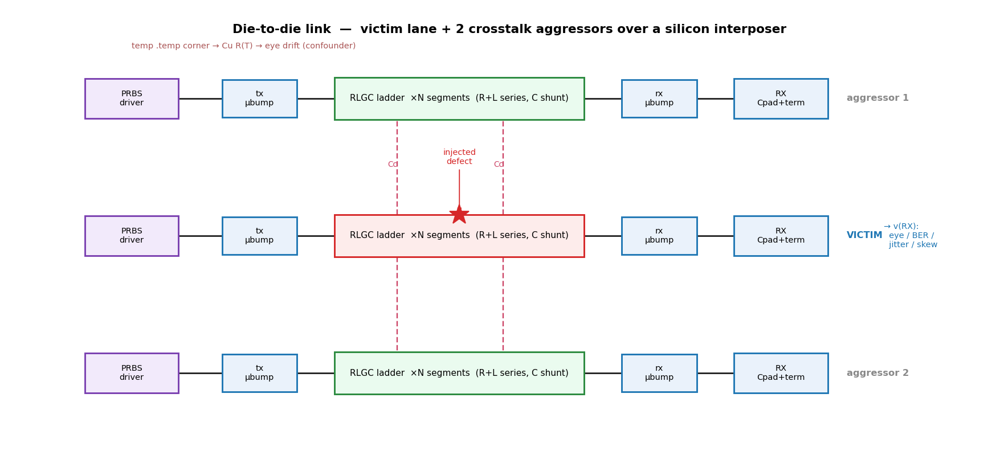

Per-lane netlist unit cell

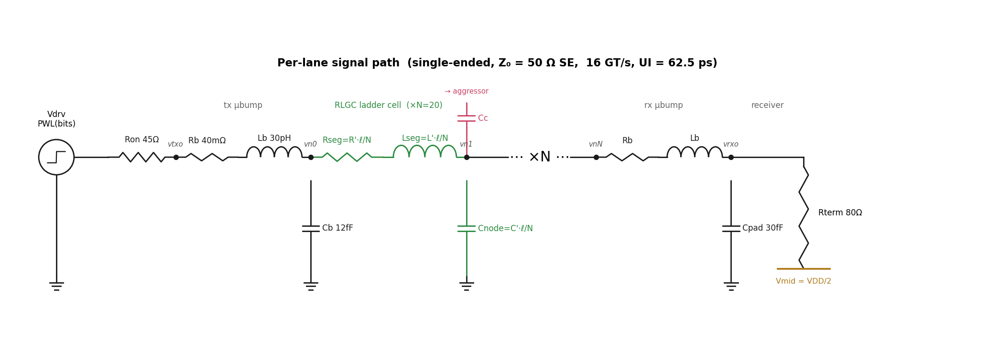

Defect-injection map

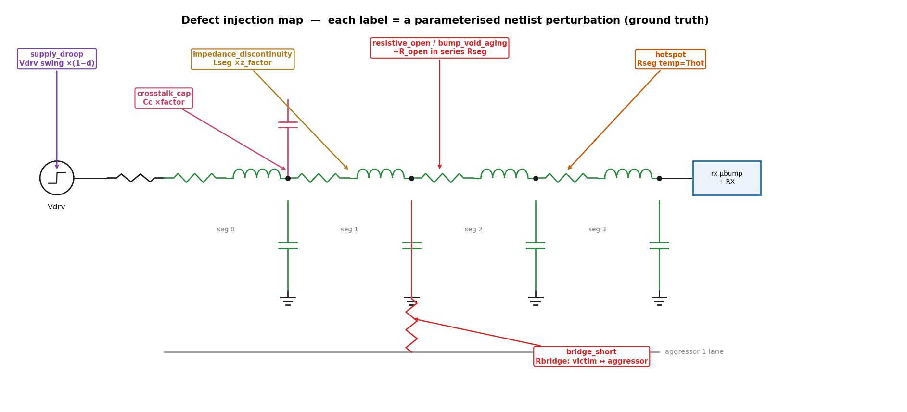

## Contact sheet (ideal PWL front-end)

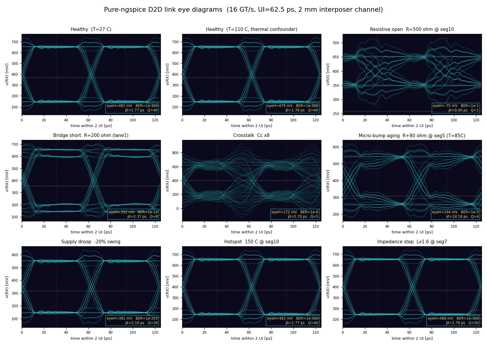

## Active behavioural front-end (multiphysics)

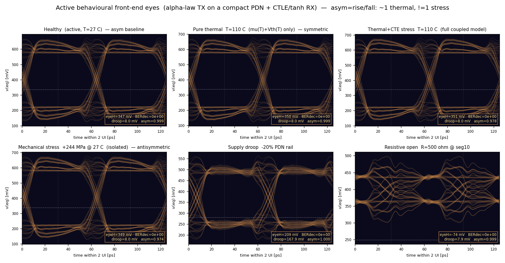

## Dataset overview

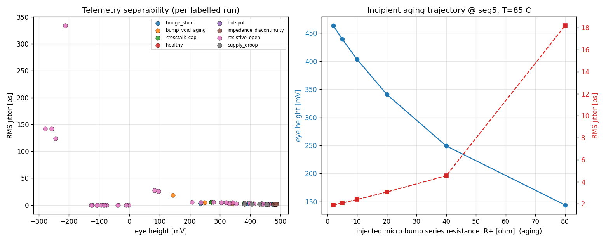

## Individual eyes — ideal front-end

**Healthy  (T=27 C)**

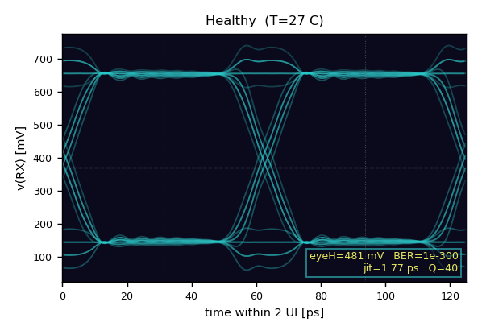

**Healthy  (T=110 C, thermal confounder)**

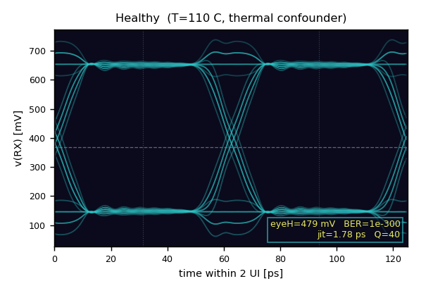

**Resistive open  R=500 ohm @ seg10**

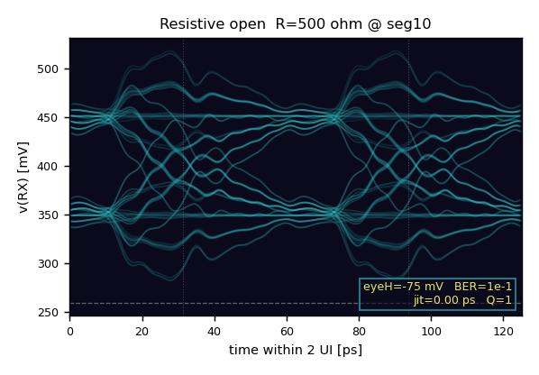

**Bridge short  R=200 ohm (lane1)**

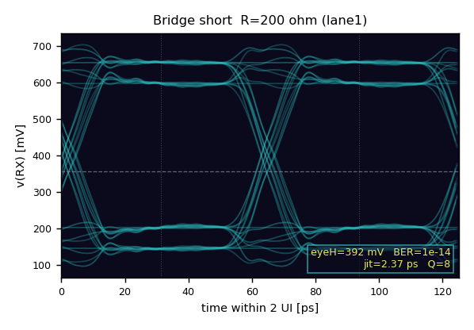

**Crosstalk  Cc x8**

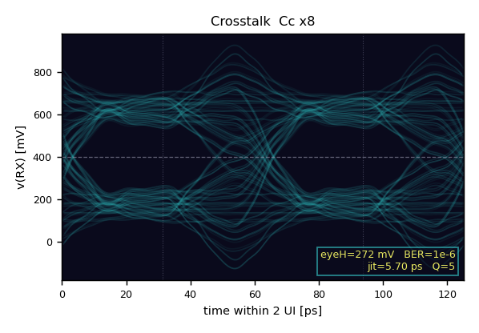

**Micro-bump aging  R+80 ohm @ seg5 (T=85C)**

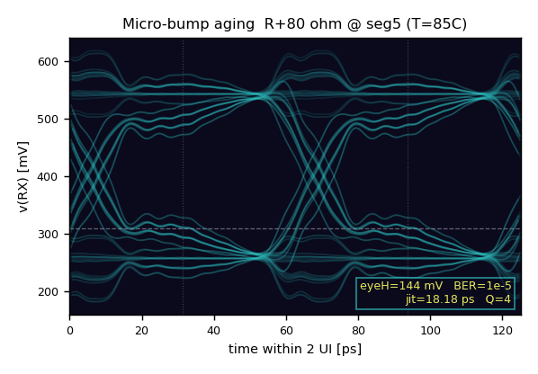

**Supply droop  -20% swing**

**Hotspot  150 C @ seg10**

**Impedance step  Lx1.6 @ seg7**

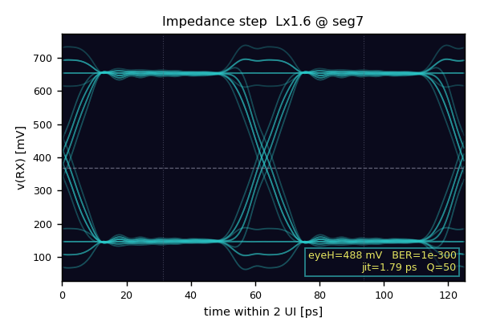

## Individual eyes — active behavioural front-end

**Healthy  (active, T=27 C)  — asym baseline**

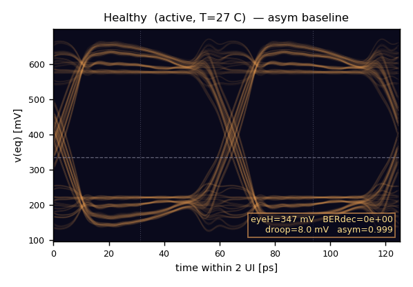

**Pure thermal  T=110 C  (mu(T)+Vth(T) only)  — symmetric**

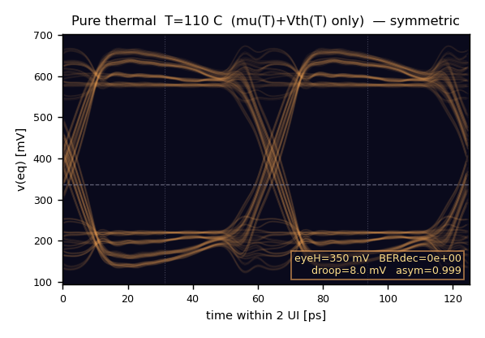

**Thermal+CTE stress  T=110 C  (full coupled model)**

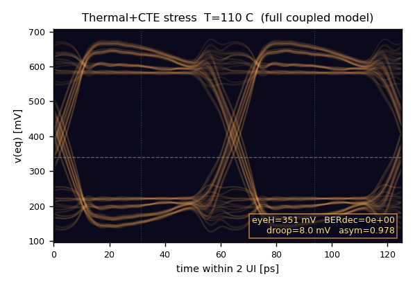

**Mechanical stress  +244 MPa @ 27 C  (isolated)  — antisymmetric**

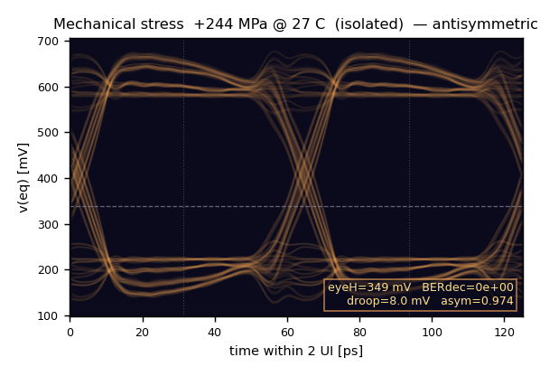

**Supply droop  -20% PDN rail**

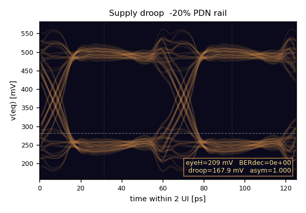

**Resistive open  R=500 ohm @ seg10**

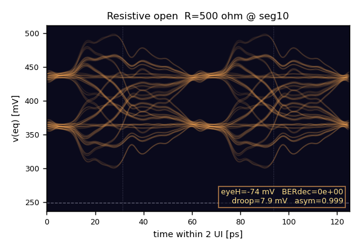
